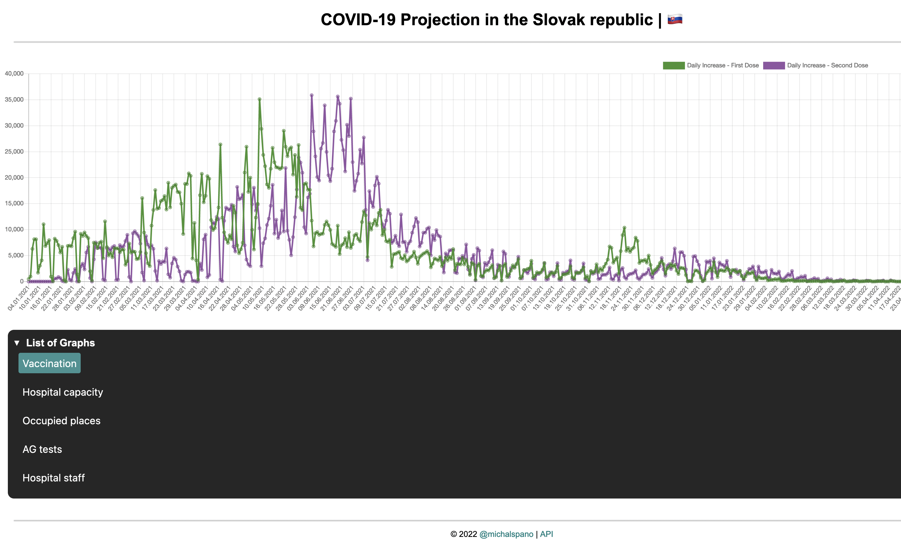

<h2 align="center">Covid-19 Visualisation in the Slovak Republic &#x1f1f8;&#x1f1f0;</h2>


An interactive visualisation of the Covid-19 pandemic in the Slovak Republic created using `Python`'s `Flask` framework and `Chart.js` library to display the data (in the form of interactive charts) on the web. Furthermore, the `API` which provides the continuous data is obtained from the [_korona.gov.sk_](https://korona.gov.sk/) website.

## Important &#10071;

As of now, the website's __hosting__ is __not__ available due to __Heroku__'s new policies regarding the __free__ account tier. However, the website can still be __run__ locally on your machine.

### (Static) Demo



### Running the website locally

Follow the steps below to run the website locally on your machine:

```sh
# 1. Clone the repository
git clone https://github.com/michalspano/covid19-visualised-sk.git && cd covid19-visualised-sk/

# 2. Create a virtual environment
python3 -m venv venv

# 3. Activate the virtual environment
source venv/bin/activate

# 4. Install the required dependencies
pip3 install -r requirements.txt

# 5. Run the website
python3 app.py
```
